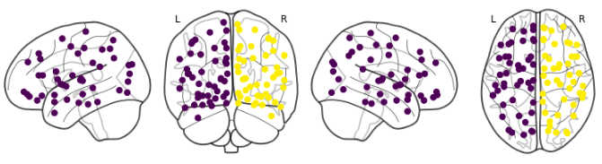

# Spectral Clustering of Brain Regions

Brain regions, classified: 

### Goal:
In this notebook we implement an open source version of a 2012 PLoS One paper [1].  
In this paper it was found, by using the connectivities between 90 regions in the brain of 14 healthy patients, that:
1. It is possible to classify brain regions based on ther connectivity strength between them;
2. The classified regions are roughly equivalent to well-defined anatomical parts of the brain;

### Libraries
We make use of `sklearn` [`Spectral Clustering`](http://scikit-learn.org/stable/modules/generated/sklearn.cluster.SpectralClustering.html) for clustering as well as of `nilearn` [plot connectome](https://nilearn.github.io/modules/generated/nilearn.plotting.plot_connectome.html) for plotting the brain regions.

### Jupyter Notebook Rendering
Sometimes github won't render the .ipynb so check out [this viewer](http://nbviewer.jupyter.org/github/pfdamasceno/spectral_decomposition/blob/master/1.Spectral_clustering_AAL.ipynb) for a rendered version of the notebook.

### References
[1] [Statistics of Weighted Brain Networks Reveal Hierarchical Organization and Gaussian Degree Distribution. Ivković, Kuceyeski & Raj. PLoS One (2012).](https://doi.org/10.1371/journal.pone.0035029)
